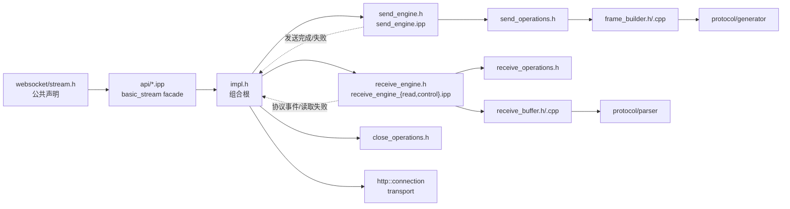

# WebSocket stream 内部结构

本目录以“声明文件拥有模板实现、组合层不反向泄漏状态”为拆分原则。实线表示
编译期包含或值成员所有权，虚线表示运行期通过 `impl` host contract 回调；engine
不会包含或访问 `impl` 的私有字段。

## 文件职责

| 入口 | 职责 | 直接依赖 |
|---|---|---|
| `api/*.ipp` | 按 core/read/write/control/close 拆分的 `basic_stream` facade | public `stream.h` 声明、`impl.h` |
| `frame_builder.h/.cpp` | 出站 frame 校验、分片、masking、wire buffers | protocol generator、UTF-8、secure random |
| `receive_buffer.h/.cpp` | 入站缓存、增量 frame parsing、message assembly | protocol parser、UTF-8 |
| `send_operations.h` | 发送 operation、write waiter、wire frame kind | `frame_builder.h` |
| `receive_operations.h` | read/control waiter | websocket types |
| `close_operations.h` | close waiter | websocket types |
| `send_engine.h/.ipp` | 发送队列、公平调度、取消和 write barrier | `send_operations.h`、`impl` host contract |
| `receive_engine.h` | 接收方向组合入口 | `receive_buffer.h`、`receive_operations.h` |
| `receive_engine_read.ipp` | frame-event pump、同步/异步 message read | `receive_engine.h` 声明、`impl` host contract |
| `receive_engine_control.ipp` | Ping/Pong observer 与 control waiter | `receive_engine.h` 声明、`impl` host contract |
| `impl.h` | connection 生命周期、两个 engine 和 Close 状态的唯一组合根 | directional engines、close operations |
| `impl/core.ipp` | 构造、adopt、状态查询和 engine host 视图 | `impl.h` 声明 |
| `impl/transport.ipp` | 唯一的 connection read/write/close 接触点 | `impl.h` 声明、HTTP connection |
| `impl/write.ipp` | 公共 write facade、同步 write、自动 Pong 桥接 | `send_engine` |
| `impl/read.ipp` | 公共 read facade 和 message buffer 转换 | `receive_engine` |
| `impl/control.ipp` | 公共 control facade 和同步 Ping 处理 | 两个 directional engines |
| `impl/close.ipp` | Close handshake、deadline、peer/local close 状态机 | 两个 directional engines、transport/lifecycle 方法 |
| `impl/lifecycle.ipp` | cancel、shutdown、EOF、protocol/transport failure 终态 | transport、Close completion |

## 代码跳转路径

- 写消息：`stream.h` → `api/write.ipp` → `impl/write.ipp` → `send_engine.ipp` → `frame_builder.cpp`；
- 读消息：`stream.h` → `api/read.ipp` → `impl/read.ipp` → `receive_engine_read.ipp` → `receive_buffer.cpp`；
- 观察控制帧：`stream.h` → `api/control.ipp` → `impl/control.ipp` → `receive_engine_control.ipp`；
- 关闭连接：`stream.h` → `api/close.ipp` → `impl/close.ipp`，仅在需要 I/O 或终态切换时跳到
  `impl/transport.ipp` 或 `impl/lifecycle.ipp`。

`.ipp` 是对应声明头的私有模板实现片段，不应直接 include：

- `stream.h` 只包含并拥有按功能拆分的 `api/*.ipp`；
- `send_engine.h` 只包含并拥有 `send_engine.ipp`；
- `receive_engine.h` 只包含并拥有两个 `receive_engine_*.ipp`；
- `impl.h` 只包含并拥有 `impl/*.ipp`。

每个 `.ipp` 都检查其 owning header 的 include guard，因此错误的直接引用会给出明确
诊断，而不会依赖其他头文件碰巧传导出的符号或包含顺序。
